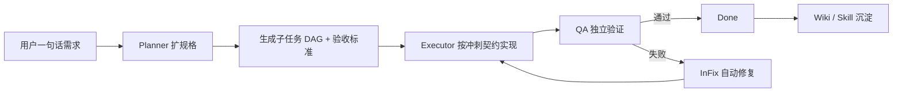

# TokenJuice 白板

榨干每一单位 token 效率的多 Agent 白板工作台。


TokenJuice 白板是一个面向 Claude Code / AI Agent 工作流的开源控制台：把任务拆解、顺序/并行调度、执行、自动 QA、修复循环、Wiki 沉淀和 Skill 自进化放在同一个白板上。它不是又一个普通 TODO 看板，而是一个让“规划器、执行器、评估器”持续协作的 agent workbench。

**SEO Title:** TokenJuice 白板 - Claude Code 多 Agent 白板工作台与 AI 自动化开发看板

**SEO Description:** TokenJuice 白板是开源 AI Agent 工作台，支持 Claude Code 多智能体调度、任务分解、自动 QA、Wiki 知识沉淀、Skill 自动生成和 token 效率优化。

**SEO Keywords:** Claude Code, AI Agent, Multi-Agent, Agent Workbench, AI Kanban, 自动化开发, 多智能体调度, Wiki 知识库, Skill 自进化, Token Efficiency, 白板工作台

## 为什么做它

长程 AI 编码最容易卡在三个地方：上下文漂移、自我评估太宽松、复杂任务乱并发。TokenJuice 白板把这些坑显式产品化：

- **规划器先扩规格**：把一句话需求扩成产品目标、子任务、验收标准、依赖关系和交接物。
- **执行器按契约交付**：每个任务都有“冲刺契约”，必须产出真实文件、验证命令和交接摘要。
- **评估器独立挑刺**：QA 不靠执行器自夸，按功能完整性、真实产物、可用性、视觉设计和代码质量打分。
- **依赖感知调度**：同一父任务下的子任务按 `dependsOn` 顺序领取，互不依赖的任务仍可并行吃满容量。
- **失败自动回环**：测试失败自动进入修复，不需要人工点“通过/打回”按钮。
- **知识沉淀闭环**：任务完成后沉淀 Wiki，复用模式沉淀为 Skill，越跑越像一个有经验的团队。

## 核心能力

- 多 Agent 看板：`Backlog -> Analyzing -> InDev -> ReadyForTest -> InFix -> Done/Blocked`。
- 自动任务分解：支持父子任务、依赖 DAG、并行组、验收标准和 QA Rubric。
- 自动 QA 调度：任务到待测试后自动由 QA agent 验证，失败自动回修复。
- transient error retry：对 429 / 529 / overloaded 这类临时错误回退重试，避免误报为业务 bug。
- Wiki + Skill：从完成任务里提取知识卡片和可复用 `.skill.md`。
- Claude agents 打包：仓库内包含 `agents/claude/` 角色模板，方便复刻规划、执行、测试、安全审查等角色。
- Web UI：一个本地浏览器白板，实时看任务、Agent、Wiki、Skill 和调度状态。
- 钉钉集成：可选 Webhook / Stream 通知和交互。

## 预览图里有什么

预览图展示了 TokenJuice 白板的主工作台：顶部是系统连接状态、调度器状态、Agent 容量和任务统计；中间是从待处理、分析中、开发中、待测试、修复中到完成的全流程看板；侧边入口覆盖 Wiki 知识库、Skill 管理和实时任务详情。这个界面适合用来观察多 Agent 的协作状态，而不是等黑盒跑完才知道成败。

## 快速开始

```bash
npm install
cp .env.example .env
npm start
```

打开：

```text
http://127.0.0.1:8085
```

如果你想用仓库自带 Claude agent 模板：

```bash
mkdir -p ~/.claude/agents
cp agents/claude/*.md ~/.claude/agents/
```

## 配置

默认端口是 `8085`，可通过环境变量调整：

```bash
PORT=8091 npm start
```

钉钉相关配置都在 `.env.example` 中给出占位示例。不要把真实 token、secret、webhook、API key 提交到仓库。

## 项目结构

```text
.
├── agents/claude/          # Claude Code agent 角色模板
├── assets/                 # GitHub README 预览图
├── docs/                   # SEO、架构与开源说明
├── public/                 # 白板 Web UI
├── skills/                 # 项目内置 Skill 与自动沉淀 Skill 示例
├── src/
│   ├── scheduler/          # 增强调度器：任务认领、QA、修复、依赖调度
│   ├── dingtalk/           # 钉钉集成
│   ├── db.js               # JSON 数据层
│   ├── wikiSkillHooks.js   # Wiki / Skill 沉淀 Hook
│   ├── skillTrackingHooks.js
│   └── index.js            # Koa API + 静态服务入口
├── data/scheduler.example.json
├── WORKFLOW.md.example
└── package.json
```

## 工作流



## API 摘要

| 分类 | 端点 | 说明 |
| --- | --- | --- |
| Board | `GET /api/board` | 看板视图 |
| Task | `GET/POST /api/tasks` | 任务管理 |
| Scheduler | `GET /api/scheduler/status` | 调度状态 |
| Skills | `GET /api/skills` | Skills 列表 |
| Wiki | `GET /api/wiki` | Wiki 列表 |
| Wiki | `GET /api/wiki/search?query=` | Wiki 搜索 |
| Stats | `GET /api/stats` | 系统统计 |
| Roles | `GET /api/roles` | Agent 角色 |

## 安全开源说明

这个仓库默认不包含：

- `node_modules/`
- `.env`
- 真实 `data/scheduler.json`
- `workspaces/` 运行产物
- `memory/` 本地记忆
- 任何真实 token / secret / webhook

发布前请运行：

```bash
rg -n "ghp_|github_pat_|sk-|api[_-]?key|token|secret|password|Bearer" .
```

如果命中真实密钥，先撤销密钥，再提交脱敏后的配置示例。

## License

MIT
