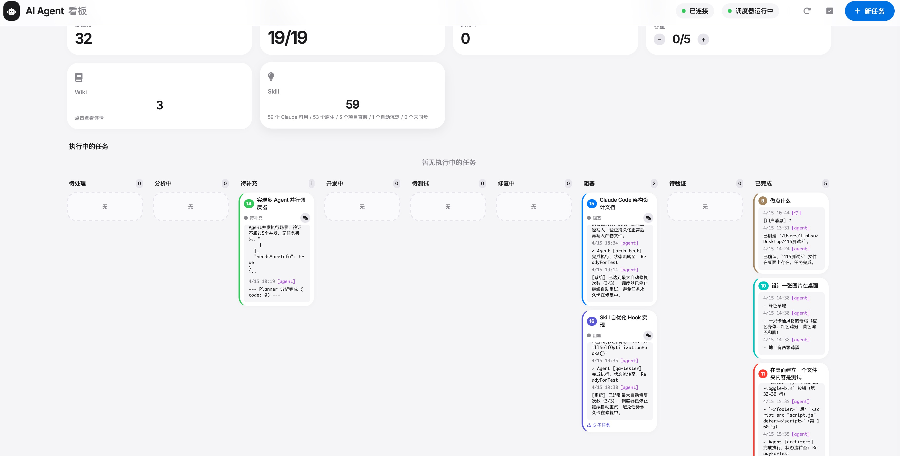

# Claude 白白板 / Claude 白白板

*榨干每一单位 token 效率的多 Agent 白板工作台*  
*TokenJuice Whiteboard — Multi-Agent Workstation for Maximum Token Efficiency*



---

## 📖 中文介绍

**Claude 白白板** 是一个面向 Claude Code / AI Agent 工作流的开源控制台：把任务拆解、顺序/并行调度、执行、自动 QA、修复循环、Wiki 沉淀和 Skill 自进化放在同一个白板上。它不是又一个普通 TODO 看板，而是一个让"规划器、执行器、评估器"持续协作的 agent workbench。

### 核心能力

- **多 Agent 看板**：`Backlog → Analyzing → InDev → ReadyForTest → InFix → Done/Blocked`
- **自动任务分解**：支持父子任务、依赖 DAG、并行组、验收标准和 QA Rubric
- **自动 QA 调度**：任务到待测试后自动由 QA agent 验证，失败自动回修复
- **transient error retry**：对 429/529/overloaded 等临时错误自动重试
- **Wiki + Skill 沉淀**：完成任务自动提取知识卡片和可复用 `.skill.md`
- **Claude agents 打包**：`agents/claude/` 角色模板（规划/执行/测试/安全审查等）
- **Web UI**：本地浏览器白板，实时看任务、Agent、Wiki、Skill 和调度状态
- **钉钉集成**：可选 Webhook / Stream 通知和交互

### 工作流程

```
用户一句话需求 → Planner 扩规格 → 生成子任务 DAG + 验收标准
  → Executor 按冲刺契约实现 → QA 独立验证
  → 通过 → Done → Wiki / Skill 沉淀
  → 失败 → InFix 自动修复 → 重新实现
```

### 快速开始

```bash
npm install
cp .env.example .env
npm start
# 打开 http://localhost:8085
```

---

## 🌐 English Introduction

**Claude 白白板 (TokenJuice Whiteboard)** is an open-source control center for Claude Code / AI Agent workflows — combining task decomposition, sequential/parallel scheduling, execution, automatic QA, fix loops, Wiki knowledge capture, and Skill self-evolution on a single visual board. It's not just another TODO kanban; it's an agent workbench where "planner, executor, and evaluator" continuously collaborate.

### Core Features

- **Multi-Agent Kanban**: `Backlog → Analyzing → InDev → ReadyForTest → InFix → Done/Blocked`
- **Automatic task decomposition**: Parent/child tasks, dependency DAGs, parallel groups, acceptance criteria, and QA Rubrics
- **Automatic QA scheduling**: Tasks auto-trigger QA agent verification; failures auto-loop to fix
- **Transient error retry**: Automatic retry on 429/529/overloaded errors — no false bugs
- **Wiki + Skill capture**: Task completion triggers knowledge cards and reusable `.skill.md`
- **Claude agents packaged**: `agents/claude/` role templates for planning, execution, testing, security review, etc.
- **Web UI**: Local browser whiteboard with real-time task, agent, Wiki, Skill and scheduling status
- **DingTalk integration**: Optional Webhook / Stream notifications and interactive commands

### Workflow

```
User request → Planner expands specs → Subtask DAG + acceptance criteria
  → Executor delivers by contract → QA independent verification
  → Pass → Done → Wiki / Skill capture
  → Fail → InFix auto-repair → Re-implement
```

### Quick Start

```bash
npm install
cp .env.example .env
npm start
# Open http://localhost:8085
```

---

## 📁 Project Structure / 项目结构

```
.
├── agents/claude/          # Claude agent role templates / Claude Agent 角色模板
├── assets/                 # Preview images / 预览图
├── docs/                   # Architecture, SEO, SKILLS docs / 架构和文档
├── public/                 # Web UI static assets / 白板前端资源
├── scripts/                # Utility scripts / 工具脚本
├── skills/                 # Built-in + auto-generated Skills / 内置与自动沉淀 Skills
├── src/                    # Core (Koa + WebSocket server) / 核心应用
├── test/                   # Tests / 测试
├── data/                   # Runtime data (not committed) / 运行数据
├── WORKFLOW.md            # Development workflow guide / 开发流程指南
├── README_zh.md           # Chinese version / 中文版
└── package.json
```

## 🔒 Security / 安全说明

No secrets are committed. Run before publishing:

```bash
npm run scan:secrets   # or: node scripts/secret-scan.mjs
```

Excluded from git: `node_modules/`, `.env`, `data/*.json`, `workspaces/`, `memory/`

---

## 📄 License / 许可证

MIT License

---

## 🔗 Links / 链接

- **GitHub**: https://github.com/MaiHHConnect/claude-whiteboard
- **Chinese README**: [README_zh.md](README_zh.md)

---

*Claude 白白板 — Every token counts. 每一单位 token 都榨干。*
